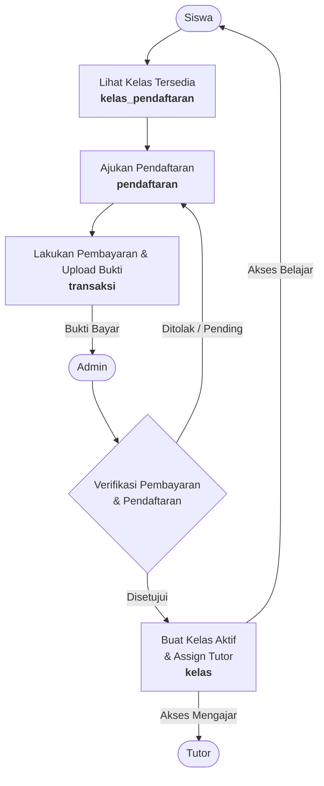
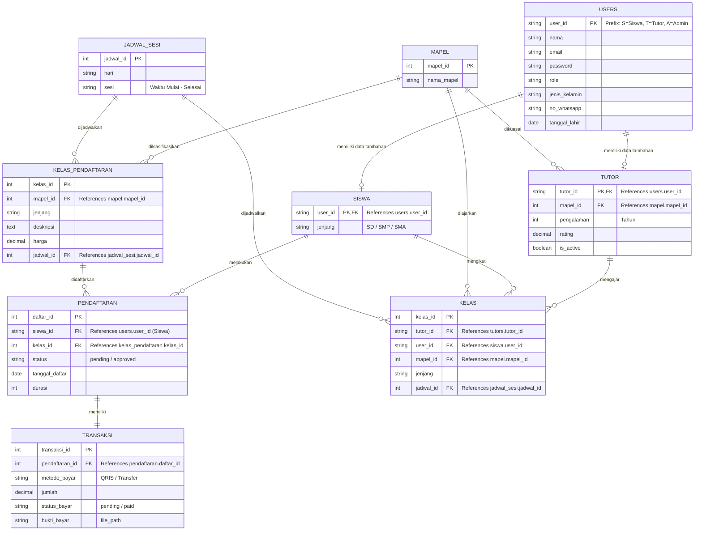

# 🎓 Study Buddy: Platform Penyedia Jasa Tutor Privat Online

[](https://laravel.com)
[](https://www.mysql.com)
[](https://www.hitachivantara.com/en-us/products/pentaho-platform.html)

**Study Buddy** adalah platform berbasis website yang dirancang untuk mempertemukan siswa jenjang Sekolah Dasar (SD), Sekolah Menengah Pertama (SMP), dan Sekolah Menengah Atas (SMA) dengan tutor privat online yang kompeten. Aplikasi ini memudahkan proses pencarian tutor, penjadwalan belajar, pendaftaran kelas, hingga pengelolaan pembayaran secara aman dan transparan.

---

## ✨ Fitur Utama

- **Pencarian Tutor Pintar**: Menemukan tutor yang sesuai berdasarkan jenjang pendidikan, mata pelajaran, rating, dan pengalaman mengajar.
- **Manajemen Kelas & Sesi**: Pengelolaan jadwal sesi belajar yang fleksibel dan terstruktur antara siswa dan tutor.
- **Pencatatan Transaksi & QRIS**: Pendaftaran kelas dengan sistem pencatatan transaksi terintegrasi, lengkap dengan upload bukti pembayaran (QRIS/Transfer).
- **Dashboard Multi-Role**:
  - **Admin**: Mengelola data pengguna (siswa, tutor), menyetujui pendaftaran, serta melihat statistik pendapatan.
  - **Tutor**: Mengelola jadwal mengajar, profil, dan materi belajar.
  - **Siswa**: Melihat riwayat kelas, materi, dan melakukan pembayaran.
- **Analisis Data & ETL (Data Warehouse)**: Pengolahan data operasional dari database MySQL menggunakan Pentaho untuk diintegrasikan ke data warehouse guna kebutuhan analisis bisnis lanjutan.

---

## 🛠️ Teknologi yang Digunakan

- **Web Framework**: Laravel (PHP) dengan Tailwind CSS untuk tampilan yang modern dan responsif.
- **Database**: MySQL (Relational Database) untuk data transaksional aplikasi.
- **ETL Tool**: Pentaho Data Integration (Spoon) untuk proses ekstraksi, transformasi, dan pemuatan data ke Data Warehouse.

---

## 🔄 Aliran Data & Skema Relasi (Siswa, Admin, Tutor)

Sistem **Study Buddy** membagi peran pengguna menjadi tiga role utama: **Siswa**, **Admin**, dan **Tutor**. Hubungan data dan alur proses bisnis antar ketiga entitas tersebut dijelaskan di bawah ini.

### 1. Alur Proses Bisnis & Aliran Data
Diagram berikut menunjukkan bagaimana data mengalir ketika Siswa mendaftar kelas hingga Tutor ditugaskan untuk mengajar.




### 2. Skema Relasi Database (ERD)
Berikut adalah hubungan antartabel di dalam database MySQL yang merepresentasikan entitas **Siswa**, **Admin**, dan **Tutor**:



### 3. Penjelasan Peran Data
- **Siswa (Student)**:
  - Mengirim data registrasi/biodata diri ke tabel `users` dan `siswa`.
  - Membuat data transaksi pembayaran (`transaksi`) berdasarkan kelas yang dipilih dari katalog `kelas_pendaftaran`.
  - Setelah divalidasi, Siswa mendapat akses sesi kelas dengan Tutor yang ditugaskan (`kelas`).
- **Admin**:
  - Mengelola dan memvalidasi seluruh data master (`users`, `tutors`, `kelas_pendaftaran`, `mapel`, `jadwal_sesi`).
  - Mengubah status data `pendaftaran` dan `transaksi` menjadi lunas/aktif.
  - Memasukkan data hubungan baru ke dalam tabel `kelas` (menugaskan Tutor tertentu untuk mendampingi Siswa tertentu).
- **Tutor**:
  - Mengirim data keahlian, status aktif, dan pengalaman mengajar ke tabel `tutors`.
  - Menerima penugasan mengajar melalui tabel `kelas` yang dibuat oleh Admin.
  - Mengakses data profil Siswa yang akan diajarkan untuk keperluan persiapan pembelajaran.

---

## 📂 Struktur Direktori

```bash
BasDat_Kelompok 4/
├── Database/          # Backup database transaksional (.sql)
├── Laravel/           # Source code utama aplikasi web (Laravel & Tailwind)
└── Pentaho/           # File Job (.kjb) dan Transformasi (.ktr) untuk ETL
```

---

## 🚀 Panduan Setup & Instalasi

### 1. Prasyarat (Prerequisites)
Pastikan perangkat Anda sudah terinstal:
- PHP (>= 8.2) & Composer
- Node.js & NPM
- MySQL Server (XAMPP/Wampserver/Docker)
- Pentaho Data Integration (Spoon) jika ingin menjalankan ETL

### 2. Setup Database
1. Buka MySQL client Anda (misal: phpMyAdmin) dan buat database baru bernama `studybuddy`.
2. Import file database **`Database/studybuddy.sql`** ke database tersebut.

### 3. Setup Aplikasi Web (Laravel)
1. Masuk ke direktori Laravel:
   ```bash
   cd Laravel
   ```
2. Instal dependensi PHP:
   ```bash
   composer install
   ```
3. Instal dependensi Javascript/CSS:
   ```bash
   npm install
   ```
4. Salin file konfigurasi `.env.example` menjadi `.env`:
   ```bash
   copy .env.example .env
   ```
5. Konfigurasikan koneksi database di file `.env` Anda:
   ```env
   DB_CONNECTION=mysql
   DB_HOST=127.0.0.1
   DB_PORT=3306
   DB_DATABASE=studybuddy
   DB_USERNAME=root
   DB_PASSWORD=
   ```
6. Generate application key:
   ```bash
   php artisan key:generate
   ```
7. Jalankan local development server:
   ```bash
   php artisan serve
   ```
8. Jalankan Vite compiler di terminal terpisah untuk me-render CSS & JS:
   ```bash
   npm run dev
   ```

Aplikasi dapat diakses di browser melalui [http://localhost:8000](http://localhost:8000).

### 4. Menjalankan Job ETL (Pentaho)
1. Buka **Pentaho Spoon**.
2. Buka file job **`Pentaho/etl_dw_sb.kjb`**.
3. Klik **Run** untuk memulai proses ETL. Job ini secara otomatis mengeksekusi semua transformasi (`.ktr`) menggunakan path relatif.

---

## 👥 Kontributor (Kelompok 4)

Project ini dirancang dan dikembangkan sebagai tugas Basis Data oleh:
1. **Arfianti Fadilah Putri**
2. **Reihan Maulana Alhaidar**
3. **Shandika Maurifki Alhudi**
4. **Arya Putra Permana** (User)
5. **Azka Saqila Rochman**
